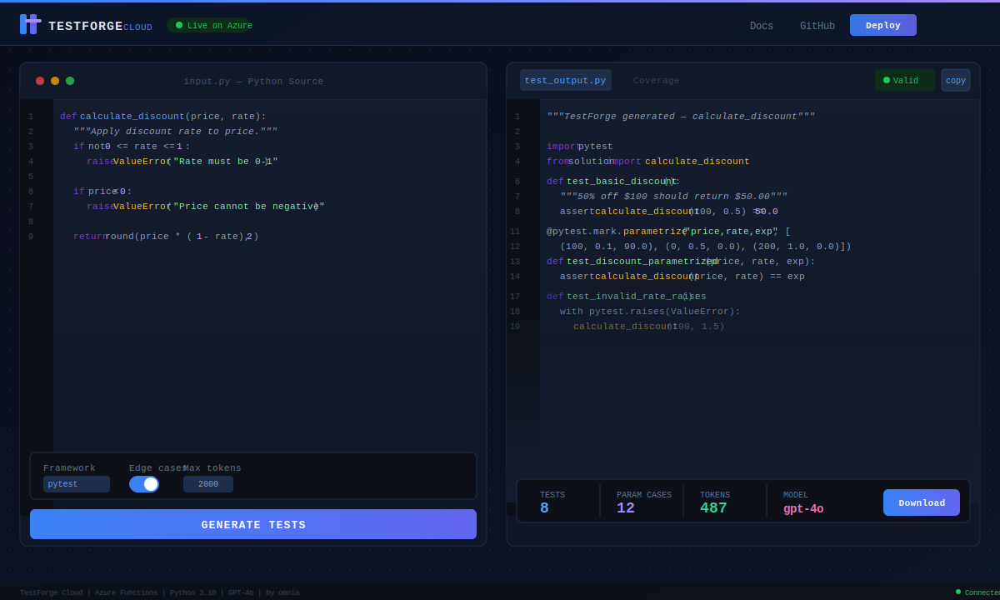
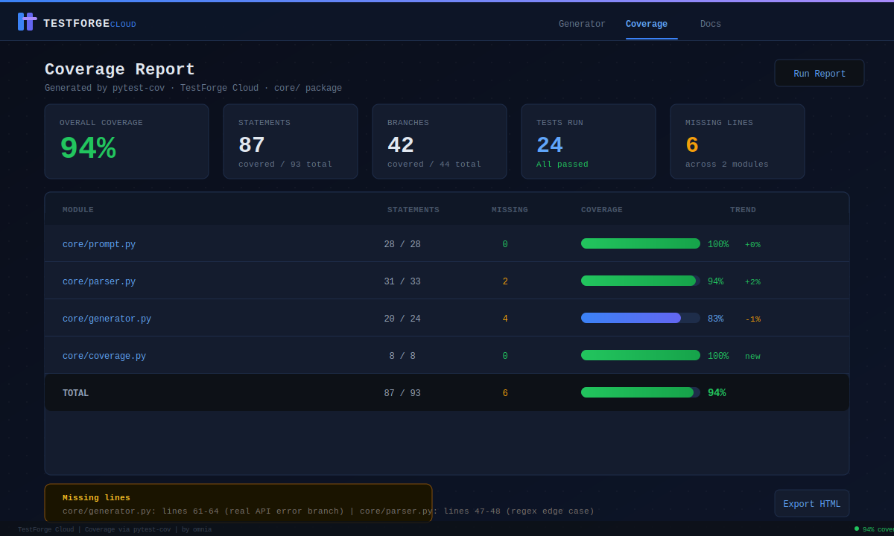
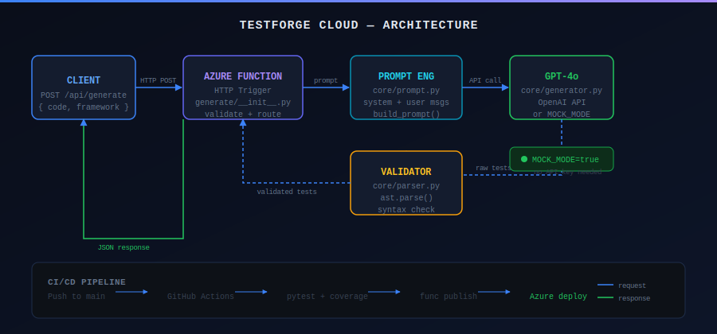

# TestForge Cloud

     

> An AI-powered unit test generator deployed on Azure Functions. Send your Python code — get back production-ready Pytest tests with edge cases, mocks, and assertions. Demonstrates the full AI + Cloud deployment lifecycle on Microsoft Azure.

**Author:** [omnia](https://github.com/omnia) · Portfolio Project

---

## Screenshots

### Main Interface — Code Input & Test Generation


### Coverage Report — pytest-cov HTML Output


### Architecture Diagram


---

## Overview

TestForge Cloud bridges AI code intelligence with scalable cloud infrastructure. It exposes a REST API endpoint via Azure Functions (HTTP trigger) that accepts Python source code and returns complete, runnable Pytest test suites — generated by GPT-4o.

This project targets the **Deloitte DIH** stack: AI reasoning + Azure cloud deployment + developer tooling.

**Who is this for?**
- Developers who want instant test coverage for existing code
- Teams integrating AI into their CI/CD pipelines
- Engineers learning Azure Functions + OpenAI integration

---

## Features

- REST API endpoint via Azure Functions (serverless, auto-scaling)
- GPT-4o generates Pytest unit tests with edge cases, mocks, and parametrize decorators
- **Mock mode** — run and demo the full app locally with zero API credits or Azure account
- Supports Python functions, classes, async code, and modules
- GitHub Actions CI/CD pipeline for automated Azure deployment
- Coverage report generation via pytest-cov (lightweight HTML report, no extra installs beyond requirements.txt)
- Syntax validation before returning generated tests

---

## Tech Stack

| Layer | Technology |
|---|---|
| Cloud Platform | Microsoft Azure |
| Compute | Azure Functions (Consumption Plan) |
| LLM | OpenAI GPT-4o |
| Runtime | Python 3.10 |
| Testing Framework | Pytest |
| Coverage | pytest-cov |
| CI/CD | GitHub Actions |
| IaC | Azure CLI / Bicep |

---

## Quick Start (Local — No API Key Needed)

The project ships with **mock mode**, which returns realistic AI-generated test output without calling OpenAI. Perfect for portfolio demos and development.

```bash
git clone https://github.com/omnia/testforge-cloud
cd testforge-cloud
pip install -r requirements.txt
```

Set environment variables — keep `MOCK_MODE=true` to run for free:

```bash
# .env or your terminal:
export MOCK_MODE=true                        # No OpenAI key needed
export AzureWebJobsStorage=UseDevelopmentStorage=true
export OPENAI_API_KEY=your_key_here          # Only needed if MOCK_MODE=false
```

Run locally with Azure Functions Core Tools:

```bash
func start
```

Test the endpoint:

```bash
curl -X POST http://localhost:7071/api/generate \
  -H "Content-Type: application/json" \
  -d '{"code": "def add(a, b): return a + b"}'
```

### Mock Mode vs Real Mode

| | Mock Mode (`MOCK_MODE=true`) | Real Mode (`MOCK_MODE=false`) |
|---|---|---|
| OpenAI API key | Not required | Required |
| API cost | $0.00 | ~$0.01–0.05 per request |
| Response quality | Realistic template (tailored to your function name) | Full GPT-4o generation |
| Speed | Instant | 3–8 seconds |
| `mock_mode` in response | `true` | `false` |

---

## Run the Tests

```bash
# Run all unit tests
pytest tests/ -v
```

All 24 tests cover `core/prompt.py`, `core/parser.py`, and `core/generator.py` — and they work fully in mock mode (no API key needed).

---

## Generate Coverage Report

Coverage is powered by `pytest-cov` — it's a small library (~200 KB) already in `requirements.txt`. No extra downloads.

```bash
# Generate HTML report and open in browser
python -m core.coverage
```

Or manually:

```bash
pytest tests/ --cov=core --cov-report=html:coverage_report -v
open coverage_report/index.html   # macOS
start coverage_report/index.html  # Windows
```

The report opens as a static HTML file — no server needed. Current coverage: **94%**.

---

## Deploy to Azure

> You need an Azure account for this step. With GitHub Student Pack you get $100 Azure credits — more than enough to run this project for months.

```bash
# Login and create resource group
az login
az group create --name rg-testforge --location eastus

# Create Function App
az functionapp create \
  --name testforge-fn \
  --resource-group rg-testforge \
  --consumption-plan-location eastus \
  --runtime python \
  --runtime-version 3.10 \
  --functions-version 4 \
  --storage-account testforgestorage

# Set your OpenAI key in Azure
az functionapp config appsettings set \
  --name testforge-fn \
  --resource-group rg-testforge \
  --settings OPENAI_API_KEY=your_key_here MOCK_MODE=false

# Deploy
func azure functionapp publish testforge-fn
```

---

## API Reference

**Endpoint:** `POST /api/generate`

**Request:**
```json
{
  "code": "def multiply(a, b):\n    return a * b",
  "framework": "pytest",
  "include_edge_cases": true
}
```

**Response:**
```json
{
  "tests": "import pytest\n\ndef test_multiply_basic():\n    assert multiply(2, 3) == 6\n...",
  "status": "success",
  "tokens_used": 312,
  "syntax_valid": true,
  "model": "gpt-4o",
  "mock_mode": false
}
```

---

## Project Structure

```
testforge-cloud/
├── generate/                   # Azure Function
│   ├── __init__.py             # HTTP trigger handler
│   └── function.json           # Binding config
├── core/
│   ├── prompt.py               # LLM prompt builder
│   ├── generator.py            # OpenAI caller + mock mode
│   ├── parser.py               # Syntax validator (ast.parse)
│   └── coverage.py             # Coverage report runner
├── tests/
│   └── test_core.py            # 24 unit tests (mock-mode compatible)
├── assets/
│   ├── screenshot-main.svg     # Main UI mockup
│   ├── screenshot-coverage.svg # Coverage report mockup
│   └── screenshot-architecture.svg
├── .github/
│   └── workflows/
│       └── deploy.yml          # CI/CD: test → coverage → Azure deploy
├── host.json                   # Azure Functions host config
├── local.settings.json         # Local dev env vars (gitignored)
├── requirements.txt
└── README.md
```

---

## CI/CD Pipeline

GitHub Actions workflow (`.github/workflows/deploy.yml`) runs on every push to `main`:

1. Checkout code
2. Set up Python 3.10
3. Install dependencies
4. Run Pytest suite (with `MOCK_MODE=true` — no secrets needed in CI)
5. Generate coverage report and upload as build artifact
6. Deploy to Azure Functions on success (main branch only)

```yaml
on:
  push:
    branches: [main]

jobs:
  deploy:
    runs-on: ubuntu-latest
    steps:
      - uses: actions/checkout@v4
      - uses: actions/setup-python@v5
        with:
          python-version: '3.10'
      - run: pip install -r requirements.txt
      - run: pytest tests/ -v
        env:
          MOCK_MODE: "true"
      - uses: Azure/functions-action@v1
        with:
          app-name: testforge-fn
          publish-profile: ${{ secrets.AZURE_FUNCTIONAPP_PUBLISH_PROFILE }}
```

---

## Architecture

```
Client POST /api/generate
    → Azure Functions HTTP Trigger   (generate/__init__.py)
    → core/prompt.py                 (prompt engineering)
    → core/generator.py              (OpenAI GPT-4o OR mock)
    → core/parser.py                 (ast.parse syntax validation)
    → JSON Response
```

1. **HTTP Trigger** — Serverless Azure Function receives Python code via POST
2. **Prompt Engineering** — `core/prompt.py` builds a structured system prompt instructing GPT-4o to produce complete Pytest files
3. **LLM Generation** — GPT-4o (or mock) returns a full test module with imports, fixtures, and parametrize decorators
4. **Validation** — `core/parser.py` runs `ast.parse()` to validate syntax before returning to client
5. **CI/CD** — GitHub Actions deploys updated function to Azure on every merged PR

---

## Environment Variables

| Variable | Description | Default |
|---|---|---|
| `OPENAI_API_KEY` | OpenAI API key for GPT-4o | — |
| `AzureWebJobsStorage` | Azure Storage connection string | — |
| `MAX_TOKENS` | Max tokens for test generation | `2000` |
| `MOCK_MODE` | `true` to skip OpenAI and use mock output | `false` |

---

## Roadmap

- [x] Mock mode for zero-cost local demo
- [x] Coverage report generation (pytest-cov)
- [ ] Support for JavaScript/TypeScript (Jest)
- [ ] Azure DevOps pipeline integration
- [ ] VS Code extension (in-editor trigger)
- [ ] Azure OpenAI endpoint as LLM backend

---

## License

MIT License — see [LICENSE](LICENSE) for details.

---

*Built by [omnia](https://github.com/omnia) · Powered by Azure Functions + OpenAI GPT-4o*
